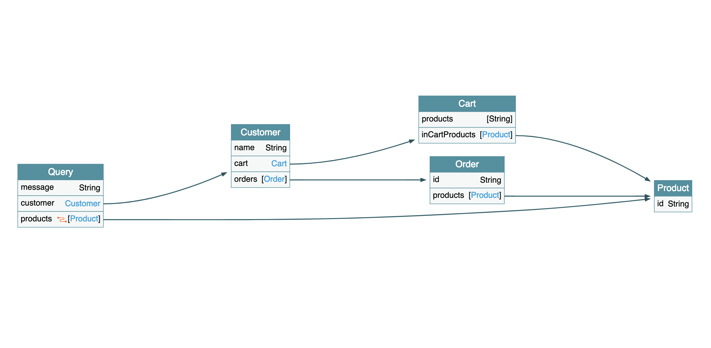

# Step by step guide

这是我们期待的最终实现结果



## 1. Query

简单的查询，直接扩展Query类型。

需求：查询顾客详情
```graphql
query {
    customer(...) {
        ...
    }
}
```

#### Schema：

```graphql
extend type Query {
    customer(name: String): Customer
}

type Customer {
    ...
}
```

#### 实现：

```java
@Component
class ... implements GraphQLQueryResolver {


    public Customer customer(String name) {
        ...;
    }
}
```

## 2. 关联查询

需求：能够获取到会员的购物车信息
```graphql
query {
    customer(name: "Kimmy") {
        cart {
            products
        }
    }
}
```


#### Schema (`1-3-query-cart`)


```graphql
extend type Customer {
    cart: Cart
}

type Cart {
    products: [String]
}

```

#### 实现 (`1-4-query-cart-implement`)

```java
@Component
class CustomerResolver implements GraphQLResolver<Customer> {

    Cart cart(Customer customer) {
        ...
    }
}
```

## 3. Mutation

需求：加入产品到购物车

```graphql
mutation {
    addCartItem(customerName: "kimmy", productId: "PRD001") {
        products
    }
}
```


#### Schema (`2-1-mutation-schema`)

```graphql
type Mutation {
    # 添加商品到购物车
    addCartItem(
        # 顾客名
        customerName: String,
        # 商品ID
        productId: String): Cart
}
```

#### 实现 （`2-2-mutation-implementation`）

```java
class ... implements GraphQLMutationResolver {

    Cart addCartItem(...) {
        ...
    }
}
```

## 4. 练习：查询购物车商品详情 （`2-3-combined-query`）

需求
```graphql
query {
    customer {
        cart {
            ?
        }
    }
}
```

- Schema 怎么改？
- 如何实现？

## 5. 练习：清空购物车（`2-5-clear-mutation-schema`）

```graphql
mutation clearCart(.. ?) {
    ?
}
```
- Schema 怎么改？
- 如何实现？

## 6. 分页

```graphql
query {
    products(first: 10, after: "MA==") {
        edges {
            node {
                id
            }
        }
    }
}
```

#### Schema

```graphql
extend type query {
    products(first: Int, after: String): ProductConnection @connection(for: "Product")
}
```

#### 实现（`3-1-paging`）

- Relay
- Connection / Edge / Node

## 7. 练习：下单

```graphql
query {
    customer {
        orders {
            id
            products {
                id
            }
        }
    }
}

mutation {
    createOrder(customerName: String): Order
}
```

#### Schema (`3-2-exercise-schema`)

